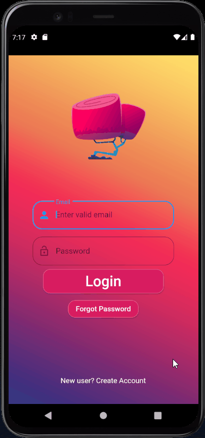
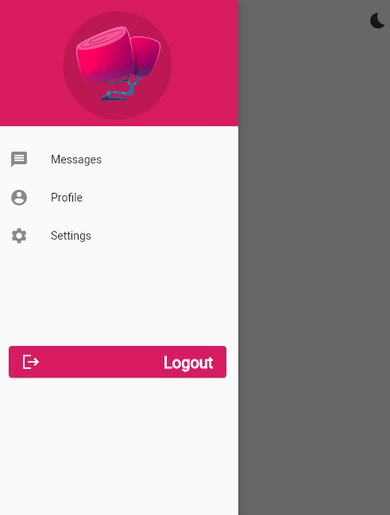

# Flutter Project

Projeto para Potfolio.

Este é uma pagina simples de login animado, mas que aborda conceitos muito utilizados em grandes apps,
app esta sendo desenvolvido com intuito de reforçar minhas skills básicas de criaçoes de UI.

# Descrição

 

 

 

 

 ## Desenvolvimento:
 - [x] Tela de login.
 - [ ] HomePage.
 - [ ] Aunteticação.
 - [ ] Animações complexas de UI.
 - [x] Utilização do Rive.
 - [x] Drawer

 
 ## Aprendizado
* Dart `null safety`. 
* Utilização de `setState`.
* Utilização de `PageController`.
* Componentização.
* Reforço em Orientação a Objetos.
* Utilização de Animações com **Rive**.

 ## Próximos passos

* Utilização de *Splash Screen*.
* Utilização de Animações com `AnimatedContainer`.
* Desenvolvimento de uma HomePage 
